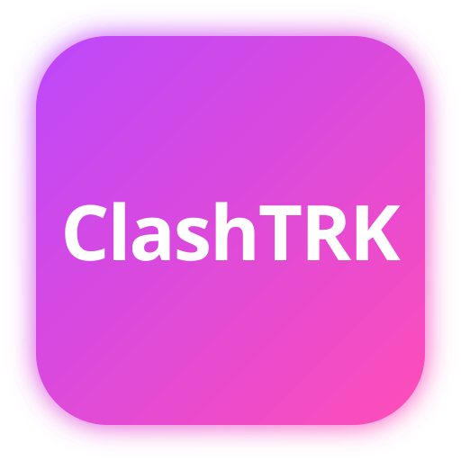

# ClashTracker

ClashTracker is a frontend application for Clash of Clans players. It combines a marketing homepage, authentication flow, and a player dashboard focused on account overview, village progress, and profile settings.

Current application version: `0.5.0`  
Release channel: `public beta`

## Overview

The current repository includes:

- a product landing page
- login, registration, email verification, and password recovery flows
- a player dashboard with views for overview, army, defense, resources, traps, laboratory, heroes, pets, and settings
- token-based authentication stored in `localStorage`
- account settings integrated with the backend API
- local dashboard display preferences saved per browser

Modules planned for later iterations:

- clan, war, and CWL sections
- Builder Base and Clan Capital support
- siege machines, achievements, and hero equipment

## Project Status

This is not a `1.0` release yet. The frontend is already structured like a fuller product, but only part of the dashboard is backed by live API data today.

- authentication and account settings already communicate with the backend
- several dashboard sections currently use prepared example data and UI scaffolding
- automated tests and Storybook are not configured yet
- the user-facing interface and validation messages are intentionally written in Polish

## Tech Stack

| Technology | Version |
| ---------- | ------- |
| Vite | ^7.2.4 |
| React | ^19.2.0 |
| TypeScript | ~5.9.3 |
| Tailwind CSS | ^4.1.18 |
| React Router DOM | ^7.12.0 |
| Axios | ^1.13.2 |
| ESLint | ^9.39.1 |
| Yarn | 1.x |

## Main Libraries

| Library | Purpose |
| ------- | ------- |
| `react-router-dom` | application routing and guarded routes |
| `axios` | HTTP communication with the backend |
| `react-toastify` | toast notifications and feedback |
| `lucide-react` | icon set used across the UI |
| `@radix-ui/react-slot` | composable shared UI primitives |
| `clsx` | conditional class name composition |

## Local Requirements

To run the project locally, prepare:

- a recent Node.js version compatible with Vite 7
- Yarn Classic `1.x`
- a working backend available through `VITE_API_URL`, or a local API exposed at `http://localhost:3000`

## Setup

1. Clone the repository.
2. Go to the project directory:

```bash
cd clash-tracker-app
```

3. Install dependencies:

```bash
yarn install
```

4. Configure the backend URL:

```bash
VITE_API_URL=http://localhost:3000
```

If your backend already uses an `/api` suffix, the frontend will automatically adapt the user settings endpoint.

## Running the App

Start the development server:

```bash
yarn dev
```

By default, the app will be available at [http://localhost:5173](http://localhost:5173).

## Available Scripts

```bash
yarn dev      # start the Vite development server
yarn build    # create a production build
yarn lint     # run ESLint across the repository
yarn preview  # preview the production build locally
```

## API Integration

The frontend currently relies on the following backend areas:

- `POST /auth/register`
- `POST /auth/login`
- `POST /auth/verify`
- `POST /auth/forgot-password`
- `POST /auth/reset-password`
- `GET /auth/me`
- `GET/PATCH /api/users/settings` or `GET/PATCH /users/settings`

The authentication token is stored under the `token` key in `localStorage` and is automatically attached as a `Bearer` token in the `Authorization` header.

## Project Structure

Key directories:

- `src/pages` for page-level views and dashboard sections
- `src/components` for shared UI building blocks
- `src/context` for authentication state management
- `src/api` for HTTP client configuration and API helpers
- `src/schemas` for form validation
- `public` for icons, manifest files, and static assets

## Recommended Next Steps

The most natural next improvements for this codebase are:

- connect live player data to every dashboard section
- introduce unit and integration tests
- add the missing informational pages linked from the footer
- expand the dashboard with clan and seasonal modules
